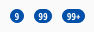
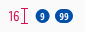
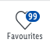

<AlertInfo alertHeadline="Modifiable">
Please ensure to comply with the corporate identity. A detailed list what can be modified can be found [here](#what-can-be-modified).
</AlertInfo>

# Badges

Use it for a number of functions, but mostly to demonstrate status and progress to the customer.

Basically they are positioned in the product tile or the tab bar.

---

## Versions

- There are different versions of the badge: **standard** and **addon**.

| Standard | Addon |
|---|---|
| Use it alone or in conjunction with text. | Used in the user-navigation of the tab bar. |

---

## Recommendations

- If you decide to use a badge, never use more than a maximum of 2 variations.
- Label the badge clearly with short, scannable text and keep the text as short as possible.

---

## Overall styling

- The font-size depends on the component but is always **bold**.
- The text-color always is **basic-white**.
- The line-height is **120%**.
- The border is in **basic-white** with a **1px thickness**.
- It always has rounded corners of **50% of its height**.

---

## Standard

- This badge is called **standard** it can be used alone or in conjunction with a text.
- It comes in 2 different sizes depending of the corresponding text-styles.
- The badge has 4 colored variations: **primary**, **highlight**, **gray** and **info**.

| Types | Attributes | Preview |
|---|---|---|
| Primary | text-style: small or basic  background-color: brand-primary-base | |
| Highlight | text-style: small or basic background-color: danger-base |  |
| Gray | text-style: small or basic background-color: gray-base | |
| Info | text-style: small or basic background-color: info-base |  |

---

## Addon

- This badge is called **addon** and is only used in the user-navigation section of the tab bar.

| Attributes | Preview |
|---|---|
| font-size: 10px line-height: 100% text-color: basic-white background-color: brand-primary-base  |  |

---

## Spacing & Measurements

### Standard

| Types | Attributes | Preview |
|---|---|---|
| Horizontal spacing | padding: 8px |  |
| Vertical spacing | padding: 2px |  |
| Distances | margin: 8px |  |

### Addon

| Types | Attributes | Preview |
|---|---|---|
| Horizontal spacing | padding: 0px |  |
| Size | 16px |  |
| Position | Overlaps an icon by 50% to the right Text expands the element to the left |  |

---

## What can be modified

- Override the text.
- Adjust the width according to the text.
- Modify badges to your project needs by changing colors of background, outline and text.
