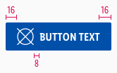
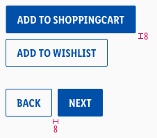

<AlertWarning alertHeadline="Not modifiable">
It is mandatory to maintain the appearance and behavior of these components.
</AlertWarning>

# Buttons

A button should lead the user to a certain action. Unique labels give the user a clear message which action is exactly triggered.

The actions can be separated into two buttons. The design of two different buttons shows the user a visual distinctions which action is needed to fulfill his task. Visually separating the primary and secondary buttons also helps to draw the attention of the user on a certain action.

---

## Recommendations

### Do's

- The secondary button can be used without the primary button.
- Keep the text short and use as few words as possible.
- Always use a specific call to action text.
- Choose a unique button labeling to send a clear message which action is exactly triggered by the button.
- Ensure consistent labelling across the user journey.
- Be sure to allow enough space for translation into other languages.
- A button with an icon may only be used in combination with an input field.

### Dont's

- Do not use more than two buttons below each other.
- Avoid exclamation marks.

**Hint!** You can use links as an alternative to a button to offer the secondary action.

---

## Types

- You can use different types of buttons: **label, label with icon, icon**.
- All devices have the same buttons sizes.
- Each button level is available in a **positive** and a **negative** version – this allows you to layout on a light or dark background.

> Use our positive buttons only on the following "light" backgrounds: **basic-white**, **gray-background** and any **lighter**-color. All other colors are "dark" backgrounds and use our negative buttons.

### Primary

- Our primary button is also our **Call-to-Action (CTA)** button.
- It only should be used once per page.
- It gives the user a hint to fulfill his task.
- It's used to guide the user into taking certain actions.
- It usually invites users to: sign in, register, purchase, etc.
- It is used to strongly suggest something that "we" want the user to do in first place.

| Version | Label| Label with icon | Icon |
|---|---|---|---|
| Positive |  |  |  |
| Negative |  |  |  |

### Secondary

- Use our secondary button if you want to show more than one button.
- It should only be used in conjunction with the primary button.
- It is offered to show the user a supporting task.
- It isn't as important and shouldn’t call as much attention as the Primary/CTA.
- Normally, secondary buttons can be used more than once per page.
- It offers users an alternative to the Primary/CTA (e.g. "back" instead of "next"; "add to wishlist" instead of "add to cart"; "edit", "delete", etc.).
- It leads the user away from his primary task or forwards to subpages of the website.

| Version | Label| Label with icon | Icon |
|---|---|---|---|
| Positive |  |  |  |
| Negative |  |  |  |

---

## Overall styling

- The text-style is [button-text](../../../../Web/Design/General/Typography/Typography.md#button-text).
- The line-height is set to **default**.
- All buttons have **rounded corners** with **2px radius**.
- Secondary buttons have a **outline** with a **1px thickness**.

### Positive

- Active states have an additional basic-black with **32% opacity** to the background.
- Disabled states have a background and font colors with **16% opacity**.

#### Primary

| State | Attributes | Preview |
|---|---|---|
| Default | background-color: brand-primary-base text-color: basic-white |  |
| Active | background: brand-primary-darker text-color: basic-white |  |
| Disabled | background: brand-disabled-base _with 16% opacity_ text-color: brand-disabled-base |  |

#### Secondary

| Status | Attributes | Preview |
|---|---|---|
| Default | outline-color: brand-primary-base text-color: brand-primary-base |  |
| Active | background-color: brand-primary-darker text-color: basic-white|  |
| Disabled | outline-color: brand-disabled-base _with 16% opacity_ text-color: brand-disabled-base |  |

### Negative

- Active state have an additional **gray-base** with **32% opacity** to the background.
- Disabled states have a background-color with **16% opacity** and a text-color with **32% opacity**.

#### Primary

| Status | Attributes | Preview |
|---|---|---|
| Default | background-color: basic-white text-color: brand-primary-base |  |
| Active | background-color: basic-white _additional gray-base with 32% opacity_  text-color: brand-primary-base |  |
| Disabled | background-color: basic-white _with 16% opacity_ text-color: basic-white _with 32% opacity_ |  |

#### Secondary

| Status | Attributes | Preview |
|---|---|---|
| Default | outline-color: basic-white  text-color: basic-white |  |
| Active | background-color: basic-white _additional gray-base with 32% opacity_ text-color: brand-primary-base |  |
| Disabled | outline-color: basic-white _with 16% opacity_ text-color: basic-white _with 32% opacity_ | |

---

## Spacing & measurements

| Type | Attributes | Preview |
|---|---|---|
| Horizontal | Buttons can be variable in width but icon and text are always centered and have 16px minimum spacing left and right. Spacing between icon and button text is always 8px. |  |
| Vertical | Text is _vertically centered_ |  |
| Height | 40px |  |
| Distance  | 8px between two buttons |  |
| Icon size | icon-size: 24x24px |  |
