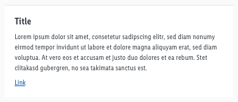
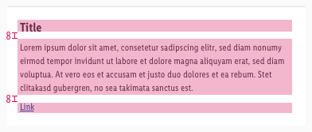
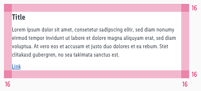

<AlertInfo alertHeadline="Modifiable">
Please ensure to comply with the corporate identity. A detailed list what can be modified can be found [here](#what-can-be-modified).
</AlertInfo>

# Cookie Alert

Users of the app have to be informed about the legal requirements or privacy policy.

---

## Recommendations

- Keep the cookie text as short as possible.
- Offer the user a clear description of the cookie settings of the app.

---

## Overall styling

- The text-style of the title is **headline 5**
- The text-style of the text is **small**.
- Text-color is **gray-darker**.
- Background-color is **white**.
- The divider at the top is 1px high and has the color **gray-lighter**.
- The height depends on the content and the additional components shown.

---

## Spacing & Measurements

| Types | Attributes | Preview |
|---|---|---|
| Padding text | 8px |  |
| Overall padding | 16px |  |

---

## Position and Content Preview

The cookie alarm is displayed at the bottom of the screen above the tabbar.

Preview coming soon ...

---

## What can be modified?

- Override the text.
- Add components like a button for your products needs.

### Our workflow in Sketch

- Use the „Overrides“-function to edit the content.
