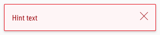

<AlertInfo alertHeadline="Modifiable">
Please ensure to comply with the corporate identity. A detailed list what can be modified can be found [here](#what-can-be-modified).
</AlertInfo>

# Hints

Different types of notifications with contextual feedback about user actions as well as permanent presentation of important information.

---

## General information

- Our "info" hint matches our brand-primary color => Blue is the best color to demonstrate an "info" hint in UX, in our case and in online studies. Part of the Lidl brand colors is "blue" and also the "brand-primary-color" on a digital device. It didn't make sense to create a new color "blue" as an "info" purpose. That's why the "brand-primary-color" for Lidl actually matches the "info" color. But if, for example, the "brand-primary-color" for Lidl will change at some point, only the components using the "brand-primary-color" will change but all the info elements will stay "blue".
- An alert is a system component in iOS. To avoid double naming and confusion, the alert is called hint in the mobile context.
- The mobile hint matches the look of the web UI kit alert.

---

## Recommendations

- **Keep the text as short as possible. Especially the title.**
- Use a hint, i.e for feedback, product recalls or support.

---

## Overall styling

- The text style is **large-bold** for the **title** and **basic** for the **text**.
- Every variant uses the **dark-color** as **text-, icon-** and **outline-color**.
- The hint background always is the main-color's **background-color**.
- The border has a **thickness of 1px**.
- The components has **rounded corners of 2px**.
- It uses the **shadow-default**.
- All widths are individually adjustable and fit into the layout columns and the 8-point-grid.
- The height depends on the content and the additional components shown.
- Every hint comes with the icon "cross" as "close" -icon in the right upper corner.

### Title & icon

- Some Hints come with an additional fixed icon to emphasize their meaning.

| Types | Attributes | Preview |
|---|---|---|
| danger | border- & text-color: danger-dark background-color: danger-background icon-color: danger-dark fixed icon: exclamation-triangle.svg |  |
| info | border- & text-color: info-dark background-color: info-background icon-color: info-dark fixed icon: information-circle.svg |  |
| success | border- & text-color: success-dark background-color: success-background icon-color: success-dark fixed icon: hook-circle.svg |  |
| warning | border- & text-color: warning-dark background-color: warning-background warning-color: warning-dark fixed icon: exclamation-circle.svg |  |
| gray / neutral | border- & text-color: gray-darker background-color: gray-background gray-color: gray-darker icon: not fix (currently placeholder.svg) |  |

### Text

- Simple Hints to only display text.

| Types | Attributes | Preview |
|---|---|---|
| info | border- & text-color: info-dark background-color: info-background |  |
| danger | border- & text-color: danger-dark background-color: danger-background |  |
| success | border- & text-color: success-dark background-color: success-background |  |
| warning | border- & text-color: warning-dark background-color: warning-background |  |
| gray / neutral | border- & text-color: gray-darker background-color: gray-background |  |

---

## Spacing & Measurements

| Types | Attributes | Preview |
|---|---|---|
| Horizontal spacing | padding: 16px |  |
| Vertical spacing | padding: 16px margin-bottom: 8px |  |
| Icon size | meaning: 32x32px close: 16x16px |  |

---

## Specials

- Hints can also be used in their brand-primary color besides or with just a different meaning to the „info“-hint (i.e. „brand-primary“ or „wine“)

---

## What can be modified?

- Override the text and icons.
- Adjust the width and height according to the content.
- Modify Hints to your project needs by adding other symbols or styles (i.e. like dividers or links).

### Our workflow in Sketch

- Use the „Overrides“-function to select the required variant, to edit the content, to change the icon if necessary or if the hint can’t be closed.
