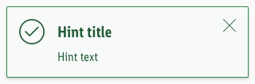
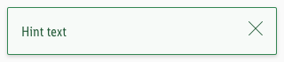
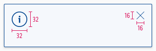

<AlertInfo alertHeadline="Modifiable">
Please ensure to comply with the corporate identity. A detailed list what can be modified can be found [here](#what-can-be-modified).
</AlertInfo>

# Hints

The hint notifications gives the user information about important content information.

---

## General information

- **Our "info" hint matches our brand-primary color**. Blue is the best color to demonstrate an "info" hint in UX, in our case and in online studies. Part of the Lidl brand colors is "blue" and also the "brand-primary-color" on a digital device. It didn't make sense to create a new color "blue" as an "info" purpose. That's why the "brand-primary-color" for Lidl actually matches the "info" color. But if, for example, the "brand-primary-color" for Lidl will change at some point, only the components using the "brand-primary-color" will change but all the info elements will stay "blue".
- The mobile hints matches the look of the [CAKE Web alerts](../../../../Web/Design/Components/Alert/Alert.html).

---

## Usage

- It can be placed anywhere in the content area.
- It stays in the defined content area.
- It displays content based information like "Product recall" or "Important customer information".
- It can be closed via an "X" or "Close" CTA.

---

## Recommendations

- **Keep the text as short as possible. Especially the title.**

---

## Overall styling

- The text style is **large-bold** for the **title** and **basic** for the **text**.
- Every variant uses the **darker-color** as **text-** and **icon-color**.
- The outline comes in **base-color**.
- The alert background always is the main-color's **background-color**.
- The border has a **thickness of 1px**.
- The components has **rounded corners of 2px**.
- It uses the **shadow-default**.
- All widths are individually adjustable and fit into the layout columns and the 8-point-grid.
- The height depends on the content and the additional components shown.
- Every alert comes with the icon "cross" as "close" -icon in the right upper corner.

### Title & icon

- Some Hints come with an additional fixed icon to emphasize their meaning.

| Version | Attributes | Preview |
|---|---|---|
| primary | text- & icon-color: primary-darker outline-color: primary-base background-color: primary-background fixed icon: information-circle.svg |  |
| danger | text- & icon-color: danger-darker outline-color: danger-base background-color: danger-background fixed icon: exclamation-triangle.svg |  |
| info | text- & icon-color: info-darker outline-color: info-base background-color: info-background fixed icon: information-circle.svg |  |
| success | text- & icon-color: success-darker outline-color: success-base background-color: success-background fixed icon: hook-circle.svg |  |

### Text

- Simple Hints to only display text.

| Version | Attributes | Preview |
|---|---|---|
| primary | text- & icon-color: primary-darker outline-color: primary-base background-color: primary-background |  |
| danger | text- & icon-color: danger-darker outline-color: danger-base background-color: danger-background |  |
| info | text- & icon-color: info-darker outline-color: info-base background-color: info-background |  |
| success | text- & icon-color: success-darker outline-color: success-base background-color: success-background |  |

---

## Spacing & Measurements

| Types | Attributes | Preview |
|---|---|---|
| Horizontal spacing | padding: 16px |  |
| Vertical spacing | padding: 16px margin-bottom: 8px |  |
| Icon size | meaning: 32x32px close: 16x16px |  |

---

## Specials

- Hints can also be used in their brand-primary color besides or with just a different meaning to the „info“-hint (i.e. „brand-primary“ or „wine“)

---

## What can be modified?

- Override the text and icons.
- Delete the closing icon if not needed for your project.
- Modify Hints to your project needs by adding other symbols or styles (i.e. like dividers or links).

### Our workflow in Sketch

- Use the „Overrides“-function to select the required variant, to edit the content, to change the icon if necessary or if the hint can’t be closed.
