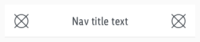
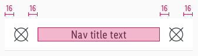
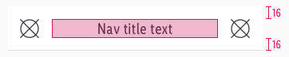
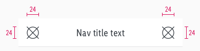

<AlertWarning alertHeadline="Not modifiable">
It is mandatory to maintain the appearance and behavior of these components.
</AlertWarning>

# Navigation bar

It helps the user navigate step-by-step through an app, provides information about the current position, or has additional options available.

Mostly a backward option is offered in the left navigation bar.

---

## General information

- Extend the icon in the right section in landscape mode or on a tablet to offer all the features of a page at a collected location.
- The navigation bar has a fixed height but always needs to be positioned differently under the status bar depending on the device.

---

## Overall styling

- The text-style is **large**.
- The line-height is **120%**.
- The text-color always is **gray-darker**.
- The icon-color follows the rule for **navigation and status icons**.
- The divider comes in **gray-lighter** and has a **thickness of 1px**.

---

## Spacing & Measurements

| Types | Attributes | Preview |
|---|---|---|
| Horizontal spacing | padding: 16px  |  |
| Vertical spacing | padding: 16px |  |
| Size | icon: 24x24px |  |
| Height | fixed: 56px |  |
