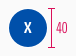
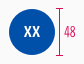
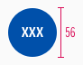

<AlertInfo alertHeadline="Modifiable">
Please ensure to comply with the corporate identity. A detailed list what can be modified can be found [here](#what-can-be-modified).
</AlertInfo>

# Pin group

The pin group is used for the store finder in the app.

Use it on maps to show a store location or store groups.

---

## Overall styling

- The text-style is [basic bold](../../../../Web/Design/General/Typography/Typography.md#basic-bold).
- The line-height is **120%**.
- The font-color is **basic-white**.
- The background-color is **brand-primary-base**.
- The border is in **basic-white** with a **1px thickness**.

---

## Usage

- Place the pin group on a map in your prototyp.
- While zooming out, individual pins merge into a pin group.
- Use the appropriate size depending on how many stores you want to display.

---

## Spacing & measurements

| Types | Attributes | Preview |
|---|---|---|
| Size | single-digit: 40px   double-digit: 48px   triple-digit: 56px |   |
|Text| **horizontally** and **vertically centered** in the circle| ||

---

## What can be modified

- Override the text.
- Adjust the size depending on the digits.
