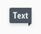
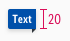
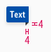

<AlertInfo alertHeadline="Modifiable">
Please ensure to comply with the corporate identity. A detailed list what can be modified can be found [here](#what-can-be-modified).
</AlertInfo>

# Ribbons

Use ribbons to add unique selling prepositions or other information.

Basically it is positioned in a context with a product tile, teaser, or image.

---

## Overall styling

- The text style is **small bold**.
- The line height is **120%**.
- The color of the triangle always is **gray-darker**.
- The background-shadow is **shadow-default**.
- The background has **rounded corners of 2px on the upper- & lower-left**.

---

## Recommendations

- If you decide to use a ribbon, never use more than a **maximum of 2 variations**  *(our "info" ribbon matches our brand-primary color due to the purpose of the color "blue")*.
- At best, the width of the ribbon should not overlap more than **50% of the underlying element**.

---

## Variants

- The ribbon has 4 colored variations: **primary**, **highlight**, **gray** and **info**.
- Our "info" ribbon matches our brand-primary color due to the purpose of the color "blue".

| Variants | Attributes | Preview |
|---|---|---|
| primary | text-color: basic-white background-color: brand-primary-base |  |
| highlight | text-color: basic-white background-color: danger-base |  |
| gray | text-color: basic-white background-color: gray-base |  |
| info | text-color: basic-white background-color: info-base |  |

---

## Spacing & measurements

| Types | Attributes | Preview |
|---|---|---|
| Horizontal spacing | padding-left/-right: 4px |  |
| Height | ribbon: 20px with triangle: 24px |  |
| Size | triangle: 4x4px |  |

---

## Position

coming soon ...

---

## What can be modified

- Override the text.
- Adjust the height and width according to the text.
