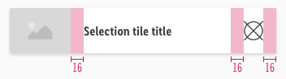
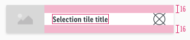
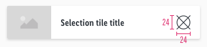
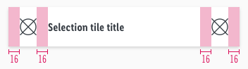
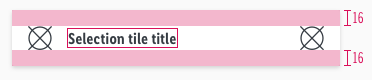
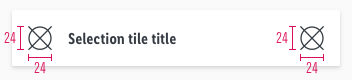
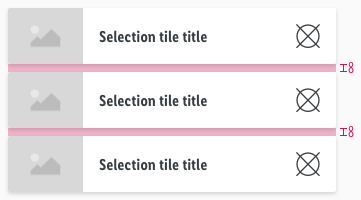

<AlertInfo alertHeadline="Modifiable">
Please ensure to comply with the corporate identity. A detailed list what can be modified can be found [here](#what-can-be-modified).
</AlertInfo>

# Selection Tile

The selection tile is a default tile that can be used in many ways.

It can be modified to visualize tiles like the online shop categories tile, flyer tile and the watch list entries within the LIDL App.

---

## Recommendations

- Ideally, the tile title should be single-line or a maximum of two lines.
- The look of the default selection tile is not mandatory. We only deliver a default selection tile that can be modified to your projects needs.
- There are two versions. One with picture and one with icon.
- Change the text styles for your project needs but please stick to the given [text styles](/Lidl/Web/Design/General/Typography/Typography.md) of CAKE.
- Ideally use a image ratio of 4:3 but a free ratio is also possible.

---

## Overall styling

- The text-style is [basic bold](../../../../Web/Design/General/Typography/Typography.md#basic-bold).
- The line-height is **120%**.
- The font- and icon-color is **gray-darker**.
- The components has **rounded corners of 2px**.
- The background-color is **basic-white**.
- The tile uses the **shadow-default**.
- The height of the white area depends on the content and the additional components shown.

---

## Spacing & Measurements

### With image

| Types | Attributes | Preview |
|---|---|---|
| Horizontal spacing | 16px |  |
| Vertical spacing | 16px   text vertically centered |  |
| Icon size | 24px |  |

### With icon

| Types | Attributes | Preview |
|---|---|---|
| Horizontal spacing | 16px |  |
| Vertical spacing | 16px   text vertically centered |  |
| Icon size | 24px |  |

### Spacing

| Types | Attributes | Preview |
|---|---|---|
| Spacing | 8px between tiles |  |

---

## What can be modified?

- Override the text, icons or image.
- Adjust the width or height of symbols according to the width of the device.
- Adjust the ratio to any size but please try to stick to a 4:3-ratio.
- Change the text to a two line scenario or even more.
- Modify the selection tile to your project needs by adding other symbols to the tile (i.e. ribbons, priceboxes, product ratings, badges).

### Our workflow in Sketch

- To change the text or image use the "Overrides"-function.
- Place additional elements like a icon on top of the selection tile and resize the height.
