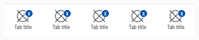
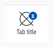
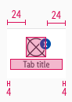
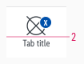
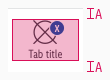
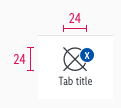
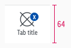
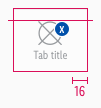

<AlertWarning alertHeadline="Not modifiable">
It is mandatory to maintain the appearance and behavior of these components.
</AlertWarning>

# Tab bar

A bar appears at the bottom of the screen, allowing the user to quickly switch between different areas within an app.

---

## General information

- The complete symbol should contain at least 4 to a maximum of 5 items.
- The symbol is designed to only work in a single line scenario .

---

## Overall styling

- The text-style is **small**.
- The line-height is **120%**.
- The letter-spacing is **-0,2**.
- The icon size is **24x24px**.
- The divider comes in **gray-lighter** and has a **thickness of 1px**.
- The background-color always is **basic-white**.
- It uses the [badge-addon](Components/Badge/Badge.md#Addon) to display a counter (e.g. how many products are in the shopping cart or wishlist).

---

## Elements

| Types | Attributes | Preview |
|---|---|---|
| Default | text-color: gray-darker icon-color: gray-darker |  |
| Active | text-color: brand-primary-base icon-color: brand-primary-base |  |

---

## Spacing & Measurements

| Types | Attributes | Preview |
|---|---|---|
| Horizontal spacing | icon: 24px text: 4px  |  |
| Vertical spacing | padding: 2px |  |
| Alignment | horizontally centered |  |
| Size | icon: 24x24px |  |
| Height | fixed: 64px |  |

---

## Position

| Types | Attributes | Preview |
|---|---|---|
| Addon | padding-right: 16px |  |

---

## What can be modified?

- Override the text and icons.
- Adjust the width of single symbols according to the width of the device and the amount of used tab bar items.
