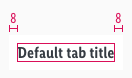

<AlertInfo alertHeadline="Modifiable">
Please ensure to comply with the corporate identity. A detailed list what can be modified can be found [here](#what-can-be-modified).
</AlertInfo>

# Tab

Tabs organize the content across different screen areas.

---

## Recommendations

- Only one tab page can be active, the other tab is default.
- Only the content of the activated tab is visible to the user.
- Use the tab to organize different content areas like "current specials" or "online shop".

---

## Overall styling

- The text-style is **basic-bold**.
- The line-height is **120%**.
- The indicator has a **thickness of 2px**.
- The background-color always is **basic-white**.

---

## Elements

| Types | Attributes | Preview |
|---|---|---|
| Default | text-color: gray-darker |  |
| Active | text-color: brand-primary-base indicator: brand-primary-base |  |

---

## Spacing & Measurements

| Types | Attributes | Preview |
|---|---|---|
| Horizontal spacing | The text is centered |  |
| Vertical spacing | 8px |  |

---

## What can be modified?

- Override the text.
- Adjust the width of single symbols according to the width of the device.
