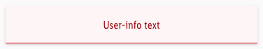
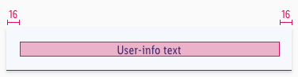
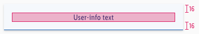

<AlertInfo alertHeadline="Modifiable">
Please ensure to comply with the corporate identity. A detailed list what can be modified can be found [here](#what-can-be-modified).
</AlertInfo>

# User info

The user info notifications gives the user information about interactions that are happening in the current moment. It only shows system based information like "Item added to your basket". It automatically slides from above into the screen.

---

## Usage

- It is sticky when scrolling.
- It leaves after a time x or if the user swips it away.
- It can not be closed via an "X" or "Close" CTA.

---

## Recommendations

- **Keep the text as short as possible.**

---

## Overall styling

- The text style is **basic**.
- The alert background always is the main-color's **background-color**.
- The indicator comes in **base-color**.
- The indicator has a **thickness of 1px**.
- It uses the **shadow-default**.
- All widths are individually adjustable and fit into the layout columns and the 8-point-grid.
- The height depends on the content and the additional components shown.

| Version | Attributes | Preview |
|---|---|---|
| primary | text-color: primary-darker   indicator-color: primary-base   background-color: primary-background |  |
| danger | text-color: danger-darker   indicator-color: danger-base   background-color: danger-background |  |
| info | text-color: info-darker   indicator-color: info-base   background-color: info-background |  |
| success | text-color: success-darker   indicator-color: success-base   background-color: success-background |  |

---

## Spacing & Measurements

| Types | Attributes | Preview |
|---|---|---|
| Horizontal spacing | padding: 16px |  |
| Vertical spacing | padding: 16px |  |

---

## What can be modified?

- Override the text and icons.
- Delete the closing icon if not needed for your project.
- Modify Hints to your project needs by adding other symbols or styles (i.e. like dividers or links).

### Our workflow in Sketch

- Use the „Overrides“-function to select the required variant, to edit the content, to change the icon if necessary or if the hint can’t be closed.
