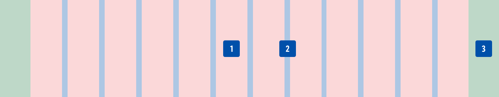
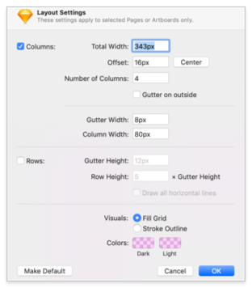
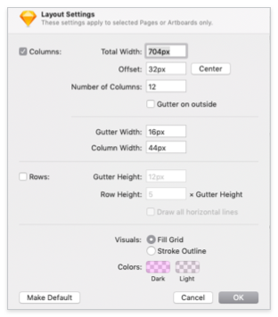
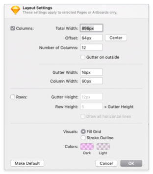
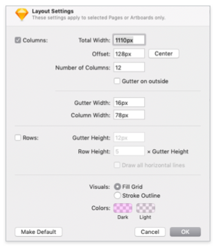
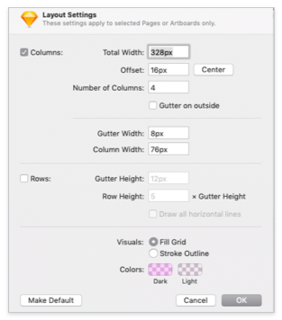
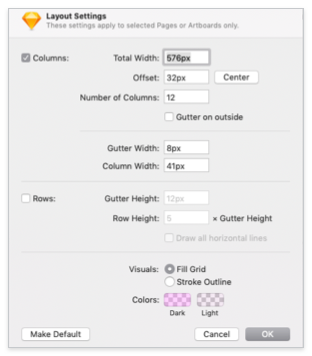
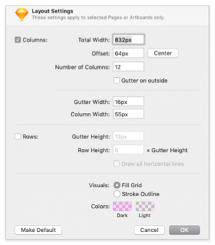
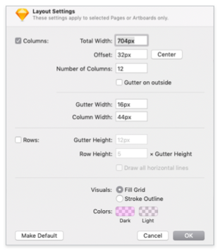
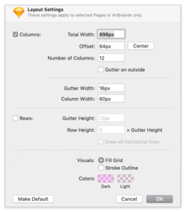

<AlertWarning alertHeadline="Not modifiable">
It is mandatory to maintain the appearance and behavior of these components.
</AlertWarning>

# Grid System

A grid system can be use to align and size objects within a given format.

---

## Usage

- Basic rules that help you to set up your pages in Sketch.
- The amount, width and spacing of the columns change with each breakpoint.

---

| 1. Columns | 2. Gutters | 3. Margins |
|---|---|---|
| Content is placed in the areas of the screen that contain columns. The number of columns displayed is determined by the selected device. | Gutters are the spaces between columns.  They help separate contents. | Margins are the space between content and the left and right edges of the screen. |

---

## Settings in Sketch

- There are 5 different artboard sizes for 6 different devices.
- The artboards for **Apple iPad 9.7"** and **ASUS Nexus 9** are identical.

### iOS

#### iPhone SE

| Artboard | iPhone SE (portrait) | iPhone SE (landscape) |
|---|---|---|
| Viewport | 375px | 667px |
| Columns | 4 columns | 12 columns |
| Gutters | 8px | 8px |
| Offset (Margins) | 16px / 16px | 32px / 32px |
| Layout settings |  |  |

#### iPad 9,7"

| Artboard | iPad 9,7" (portrait) | iPad 9,7" (landscape) |
|---|---|---|
| Viewport | 768px | 1024px |
| Columns | 12 columns | 12 columns |
| Gutters | 16px | 16px |
| Offset (Margins) | 32px / 32px | 64px / 64px |
| Layout settings |  |  |

#### iPad 12,9"

| Artboard | iPad 12,9" (portrait) | iPad 12,9" (landscape) |
|---|---|---|
| Viewport | 1024px | 1366px |
| Columns | 12 columns | 12 columns |
| Gutters | 16px | 16px |
| Offset (Margins) | 64px / 64px | 128px / 128px |
| Layout settings |  |  |

### Android

#### Smartphone

| Artboard | Android (portrait) | Android (landscape) |
|---|---|---|
| Viewport | 360px | 640px |
| Columns | 4 columns | 12 columns |
| Gutters | 8px | 8px |
| Offset (Margins) | 16px / 16px | 32px / 32px |
| Layout settings |  |  |

#### Nexus 7

| Artboard | Nexus 7 (portrait) | Nexus 7 (landscape) |
|---|---|---|
| Viewport |600px | 960px |
| Columns | 12 columns | 12 columns |
| Gutters | 16px | 16px |
| Offset (Margins) | 32px / 32px | 64px / 64px |
| Layout settings |  | 

#### Nexus 9

| Artboard | Nexus 9 (portrait) | Nexus 9 (landscape) |
|---|---|---|
| Viewport | 768px | 1024px |
| Columns | 12 columns | 12 columns |
| Gutters | 16px | 16px |
| Offset (Margins) | 32px / 32px | 64px / 64px |
| Layout settings |  |  |
