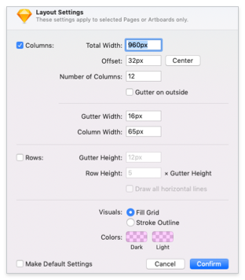

<AlertWarning alertHeadline="Not modifiable">
It is mandatory to maintain the appearance and behavior of these components.
</AlertWarning>

# Grid System

A grid system can be use to align and size objects within a given format.

---

## Usage

- Basic rules that help you to set up your pages in Sketch.
- The amount, width and spacing of the columns change with the breakpoint.
- The mobile development can independently use its preferred grid system.

---

| 1. Columns | 2. Gutters | 3. Margins |
|---|---|---|
| Content is placed in the areas of the screen that contain columns. The number of columns displayed is determined by the selected device. | Gutters are the spaces between columns.  They help separate contents. | Margins are the space between content and the left and right edges of the screen. |

---

## Settings in Sketch

- There are 4 different artboard sizes.
- There are artboards for phone and tablet view.

**Hint!** If you need to create the layout on a different device size please stick to the defined gutters and offset. The viewport and columns will then result accordingly.

### Phone

| Artboard | portrait mode | landscape mode |
|---|---|---|
| Viewport | 360px | 640px |
| Columns | 8 columns | 8 columns |
| Gutters | 8px | 8px |
| Offset/border | 16px / 16px | 16px / 16px |
| Layout settings |  |  |

### Tablet

| Artboard | portrait mode | landscape mode |
|---|---|---|
| Viewport | 768px | 1024px |
| Columns | 12 columns | 12 columns |
| Gutters | 16px | 16px |
| Offset (Margins) | 32px / 32px | 32px / 32px |
| Layout settings |  |  |
