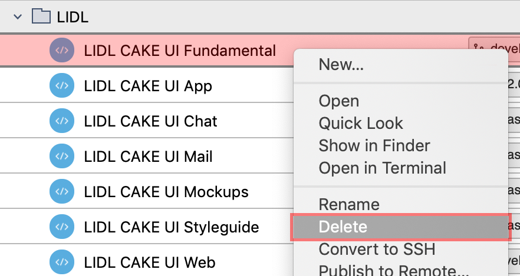
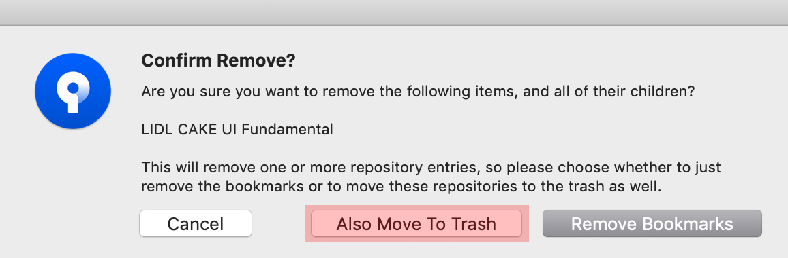
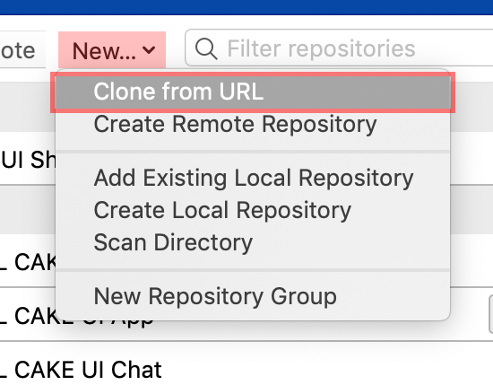
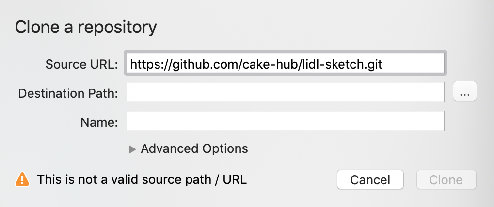
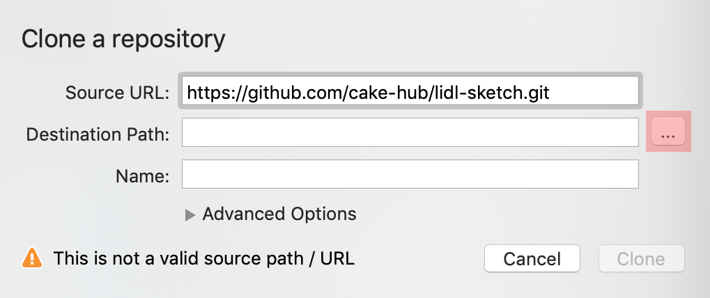
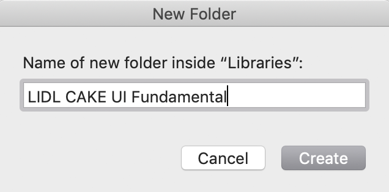
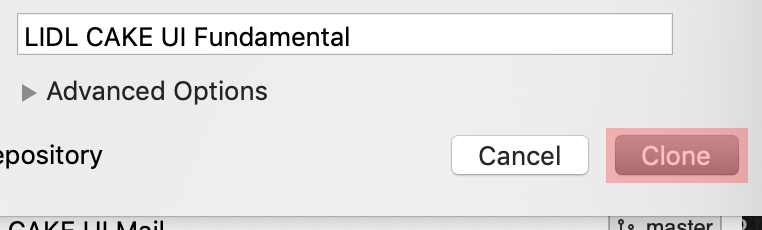

# Setup

How you get access to all our fine CAKE products.

---

## Introduction

- CAKE is now available on GitHub.
- Our recommendation is to use an external software to get access to our design system library files (e.g. Sourcetree)
- The **CAKE UI Fundamental** repository is the global library file you need to work with any other CAKE UI product (e.g. App, Chatbot, Web, Mail,… )

## Lidl on GitHub

| Project | Link |
|---|---|
| Fundamental | <https://github.com/cake-hub/lidl-sketch.git> |
| App | <https://github.com/cake-hub/lidl-app-sketch.git> |

## Tutorial

- First, disconnect your VPN if you are signed in to the Lidl network.
- Start with **Step 1** if you want to migrate to our latest version.
- Start with **Step 3** if you want to clone our repositories from scratch.
- Make sure to locate your new library files in Sketch after successfully completing the tutorial.

| Steps | Description | Preview |
|---|---|---|
| 1 | Go to Sourcetree, right-click on a cloned repository and choose delete (e.g. LIDL CAKE UI Fundamental) | |
| 2 | Confirm your remove by clicking on "Also Move to Trash" |  |
| 3 | Add the new GitHub repositories by using the "New" select-field and choose "Clone from URL" |  |
| 4 | Copy the GitHub URL from the table above and paste it into the first input-field called "Source URL" | |
| 5 | Click on "…" to choose the correct destination path | |
| 6 |  Create a new folder with the name of the repository on your local computer (e.g. under ../Lidl-UX/Libraries/…) |  |
| 7 | Complete this process by hitting the button "Clone" | |
