# Home Device Illustration

Our home device illustrations show the devices in a reduced style, so they can be easily recognized by the user. We use the shapes, color and other design elements of the device, to achieve this. Shading makes the Illustrations look realistic. Our main focus is to have a consistency in the illustration style.

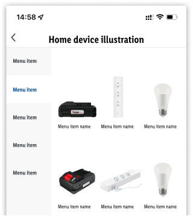

- The illustrations are displayed in an app context.
- Preferred is a **top-, front- or-side view** of the product.
- If a device is hard to recognize, a three-point perspective can be used.
- Simplify the complexity of the product.
- Be aware of the proportions.
- Use the colors from the product and set a light effect from the top left position.
- Try to to achieve a realistic appearance.
- Devices are placed on a transparent background, no shadows are needed.

---

## Create illustration

This guide describes the illustration setup and it is totally independent of the tool used to create the illustrations.

### Step 1: Create a new document

- Set width and height of 800x800px.
- Color mode: RGB

### Step 2: Layer the shapes

- Create simple shapes in the correct proportions.
- The number of levels should be manageable.
- Set gradients that are linear, radial or freehand and pick the colors from a photograph.
- Use colors to create a good contrast as well as light reflections.
- Simulate the device material - matte or glossy.
- Reduce detailed information to a minimum.

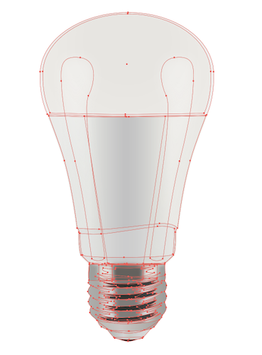

Setting | Preview
----------|---------
 Safezone 48px inside the 800x800px format | 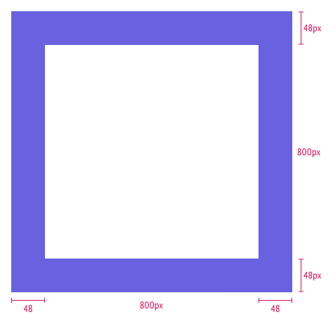
 Positioning of the object depends on the device proportions: square device = centered rectangle landscape = bottom center   rectangle portrait = bottom center| 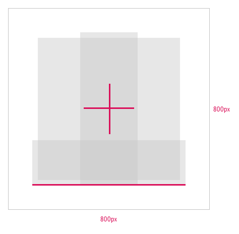

### Step 3: Proof illustration

- To test the illustration visually, we recommend to reduce the view.
- The illustration is most often placed on a light background. Ensure the sufficient color contrast.

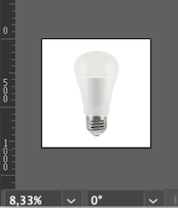

### Step 4: Export assets

- Save your working file and export it as PNG24 (background as alpha).
- Create a zip bundle and send it to the purchasing department.

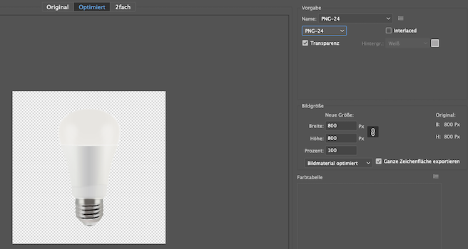

[Download Adobe Illustrator template](https://storage.cake.schwarz/cgo/templates/home-device-illu/template.ai)

---

### Examples

The material of a device can be simulated with the gradient settings.

Material | Gradient | Preview
---------|----------|---------
Flat surface | weak, simple gradient | 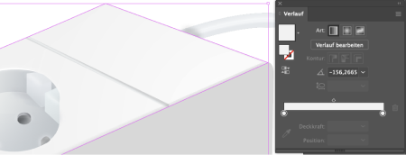
Light simulation | weak, simple gradient | 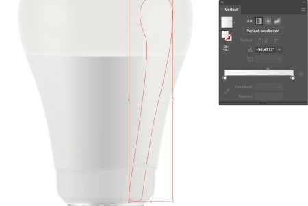
Rounding | stronger, complexer gradient | 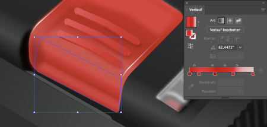
 Gradient fade out placed on dark background | Make sure the gradient mesh is colored correctly on the outer points. Don't make them white, as this will cause a grey shine around the edges on darker backgrounds.| 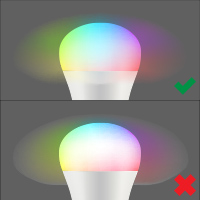

These are a non-obligatory examples of different devices in the desired illustration style.

Devices | Perspective | Preview
---------|----------|---------
 Battery | Side view | 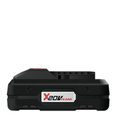
 Battery | Three point perspective | 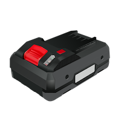
 Light bulb OFF | Front view | 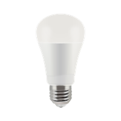
 Light bulb ON | Front view | 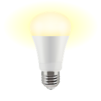
 Light bulb RGB | Front view | 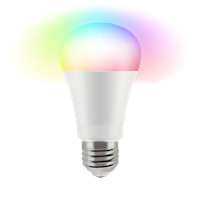
 Power strip | Top view | 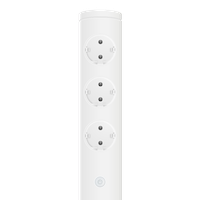
 Power strip | Three point perspective  | 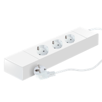

---

## Communication

- The communication and asset transfer goes through the purchasing department.
- Deliver open working files e.g. Illustrator (.ai) files.
- Deliver PNG24 export with alpha settings in the resolution of 800x800px.

