<AlertWarning alertHeadline="Not modifiable">
 It is mandatory to maintain the appearance and behavior of these components.
</AlertWarning>

# Coupon

Use this component if there is no possibility to display a specific product pricebox because the discount relates to a complete category or offer.

> Use it **only to promote LIDL Plus offers**  and only in combination with a **product tile, teaser or image**.

---

## Elements

| Attributes | Preview |
|---|---|
| 1. Discount   2. Coupon text   3. Legal info ("Lidl Plus price")| 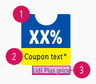 |

---

## Recommendations

- Keep the text short and **single line**.

---

## Overall styling

### Discount

- The text-style is [pricebox-small](/Lidl/Web/Design/General/General/Typography/Typography.md#pricebox-small).
- This element has **rounded corners of 2px** on the **upper left and right corner**.

| Attributes | Preview |
|---|---|
| text-color: basic-white   background-color: info-base | 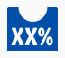 |

### Coupon text

- The text-style is [small](/Lidl/Web/Design/General/Typography/Typography.md#small).
- This element has **rounded corners of 2px** on the **lower left and right corner**.

| Attributes | Preview |
|---|---|
| text-color: basic-black   background-color: mark-base | 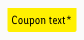 |

### Legal info

- The text-style is [pricebox-basic-quantity](/Lidl/Web/Design/General/Typography/Typography.md#pricebox-basic-quantity).
- This element follows the styling of our [positive link version](/Lidl/Web/Design/General/Link/Link.md#positive-version).
- Tapping on this info opens a bottom sheet that shows the Lidl Plus info text.

> The legal info is a required addon for the complete **LIDL Plus price** and has a fix notation of "Lidl Plus price".

| Attributes | Preview | Behavior |
|---|---|---|
| text-color: info-base | 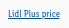 | 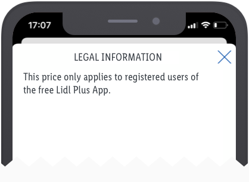   *This is a non-obligatory example.* |

---

## Spacing & measurements

| Types | Attributes | Preview |
|---|---|---|
| Horizontal spacing | 4px | 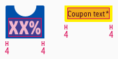 |
| Vertical spacing | padding-top: 18px / 10px (MD+SM / XS) padding-bottom: 2px| 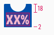 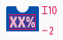|
| Height | 24px Text horizontally centered | 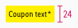 |
| Circle size | MD+SM: 32 x 16px   XS: 16 x 8px | 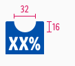 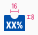 |
| Distance | margin-top: 2px | 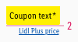

---

## Position & combinations

- The coupon is placed in the **lower left corner** instead of a pricebox.
- The distance of the coupon to the borders of the product tile is **8px** each.

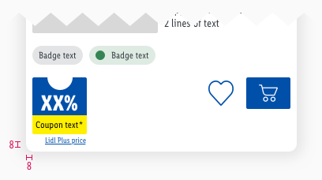

*This is a non-obligatory example.*
