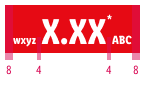
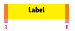
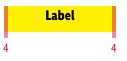
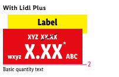

<AlertWarning alertHeadline="Not modifiable">
 It is mandatory to maintain the appearance and behavior of these components.
</AlertWarning>

# Pricebox

Use this component **only to promote a special LIDL Plus price** to the customer.

> Usage of the LIDL Plus price **must be coordinated with and permitted by the legal department of your LIDL country**.

---

## Elements

| Attributes | Preview |
|---|---|
| 1. LIDL Plus pricebox   2. LIDL Plus label   3. Recommended retail price (rrp)   4. Legal info ("Lidl Plus price")   5. Basic quantity ||

---

## Recommendations

- You have to create the complete **LIDL Plus price** due to a Sketch rescaling problem out of the following elements:
  - LIDL Plus pricebox
  - recommended retail price (rrp)
  - basic quantity
- All other elements, i.e. the LIDL Plus label or legal info, are already implemented into the LIDL Plus price symbol.

---

## Overall styling

### Pricebox

- The text-style is [pricebox-small](/Lidl/Web/Design/General/Typography/Typography.md#pricebox-small) or [pricebox-medium](/Lidl/Web/Design/General/Typography/Typography.md#pricebox-medium)
 for the two possible sizes of the price.
- The text-style is [pricebox-addon](/Lidl/Web/Design/General/Typography/Typography.md#pricebox-addon) for asterisk, currency & prefix.
- The text-color is **basic-black**.
- The background-color is **mark-base**.
- The line-height is set to **default**.
- There are **two sizes** of this component for different purposes.
- For each breakpoint, you can select a corresponding symbol with different price text sizes to suit your layout.
- Additionally you can choose between a pricebox with or without prefix.

| Size | Usage | Preview |
|---|---|---|
| Small | i.e. product overview | |
| Medium | i.e. product detail page | |

### Label

- The text-style is always [pricebox-label](/Lidl/Web/Design/General/Typography/Typography.md#pricebox-label).
- The line-height is set to **default**.
- The label is a required addon for the complete **LIDL Plus price**.

| Attributes | Preview |
|---|---|
| text-color: basic-white   background-color: info-base |  |

### Legal info

- The text-style is [pricebox-basic-quantity](/Lidl/Web/Design/General/Typography/Typography.md#pricebox-basic-quantity).
- This element follows the styling of our [positive link version](/Lidl/Web/Design/General/Link/Link.md#positive-version).
- Tapping on this info opens a a bottom sheet that shows the Lidl Plus info text.

> The legal info is a required addon for the complete **LIDL Plus price** and has a fix notation of "Lidl Plus price".

| Attributes | Preview | Behavior |
|---|---|---|
| text-color: info-base |  |    *This is a non-obligatory example.* |

### Basic quantity

- The text-style is always [pricebox-basic-quantity](/Lidl/Web/Design/General/Typography/Typography.md#pricebox-basic-quantity).
- The line-height is set to **default**.
- It's used as additional info for the packaging unit, quantity or drained weight.

| Attributes | Preview |
|---|---|
| text-color: basic-black |  |

### Discount

- The text-style is always [pricebox-addon](/Lidl/Web/Design/General/Typography/Typography.md#pricebox-addon) for the recommended retail price (rrp).
- The line-height is set to **default**.
- The positive discount is a required addon for the complete **LIDL Plus price**.

| Attributes | Preview |
|---|---|
| text-color: basic-black   strike-color: danger-base |  |

---

## Spacing & measurements

- The height of the pricebox depends on the content and the additional components shown.
- The width of the pricebox depends on the content.

### Pricebox

| Types | Attributes | Preview |
|---|---|---|
| Vertical spacing | MD+SM: 6px / 4px  XS: 4px / 2px |   |
| Horizontal spacing | MD+SM: 8px / 4px  XS: 4px / 4px |   |

### Label

- The width of the label depends on the content of the pricebox.
- The height of the label is fixed for a single-line text.

| Types | Attributes | Preview |
|---|---|---|
| Vertical spacing | MD+SM: 4px / 12px XS: 2px / 10px |   |
| Horizontal spacing | MD+SM: 8px XS: 4px |   |
| Height |MD+SM: 32px XS: 26px |   |

### Discount

| Types | Attributes | Preview |
|---|---|---|
| Discount | MD+SM: 8px / 0px  XS: 4px / 0px |   |

### Legal info & basic quantity

| Types | Attributes | Preview |
|---|---|---|
| Legal info | text and pricebox align right   margin-top: 2px |  |
| Basic quantity | text and pricebox align right   margin-top: 0px |  |

---

## Position & combinations

> Use it only in combination with a **product tile, teaser or image**.

- The pricebox is placed in the **lower left corner**.
- The distance of the price to the borders of the product tile is **8px** each.

*This is a non-obligatory example.*
